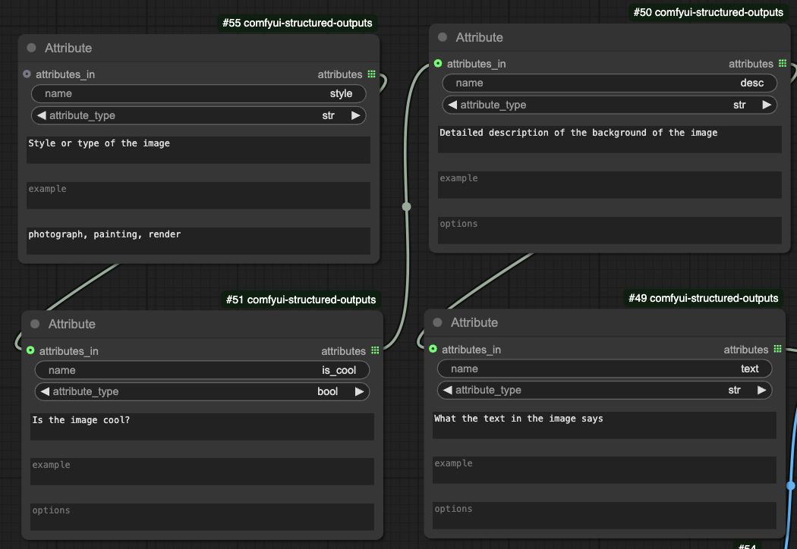
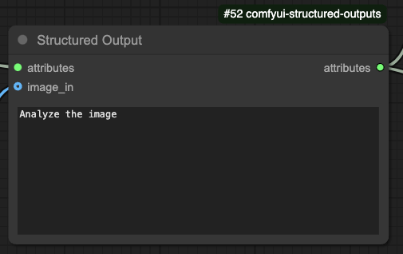
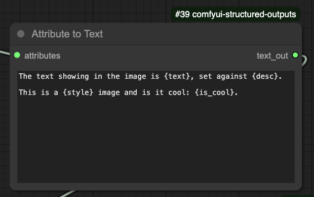
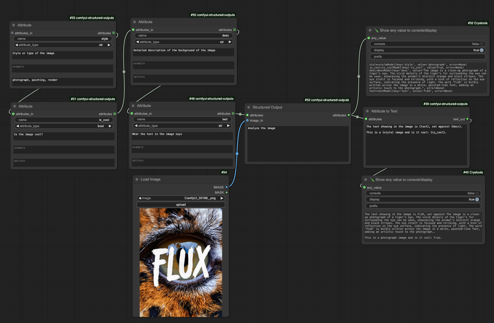

# ComfyUI LLM Structured Output Nodes
ComfyUI nodes for (V)LLM Structured Outputs

Generate structured data from text and images,
then use that data to create dynamic prompts or make decisions in your workflows.

E.g. you might use a vision LLM to analyze an image and extract descriptions of the foreground, background, and text. 
Then, using these variables in a format string, you can build a custom prompt such as:

```text
A vector art drawing of {foreground}, set against a minimalistic light {background}.

“{text}” in the top right corner is drawn in wide {color} brushstrokes.
```

## Custom Nodes

### Attribute Node



The **Attribute Node** represents a single variable in your structured output. Use it to:
- **Name the Variable:** Provide a clear, descriptive name (e.g., `foreground`).
- **Select the Data Type:** Choose a type such as `string`, `int`, or `bool`.
- **Describe the Attribute:** Add a description or an example value.
- **Define Choices:** Optionally restrict the variable to a predefined set of options.

You can chain multiple Attribute Nodes together to form a complete structured output, or use a single node if only one value is needed.

### Structured Output Node



The **Structured Output Node** generates structured data by making an LLM call. In this node you can:
- **Set a Text Prompt:** Provide an optional prompt to guide the LLM.
- **Attach Attribute Nodes:** Connect one or more Attribute Nodes to define the output structure.
- **Include an Image Prompt:** Optionally add an image input to extract visual details.

The output is a set of named variables that the LLM produces.

### Attribute to Text Node



The **Attribute to Text Node** converts the structured output into formatted text. To use it:
- **Define a Format String:** Create a text template using attribute names as variables (e.g., `The sky is {sky_color}`).
- **Connect the Structured Output:** Attach the output from the Structured Output Node.

This node outputs a formatted text prompt based on the structured variables.

## Install

1. Install comfyui
2. Install this custom nodes `comfyui-structured-outputs` via custom nodes manager
3. Copy `.env.example` to `.env` and add your OpenAI API key

## Examples

### Describing Image Parts Independently

See [describe_image_parts.json](example_workflows/describe_image_parts.json)

This example:
- 

## API Keys

To use the ComfyUI LLM Structured Output Nodes, you will need to have an API key for the OpenAI API. 

You can get one by signing up at [OpenAI](https://platform.openai.com/signup).

Copy your key and paste it into the `.env` file in the project root. 

e.g. See [.env.example](.env.example)
```
OPENAI_KEY="sk-your-key-here"
```
